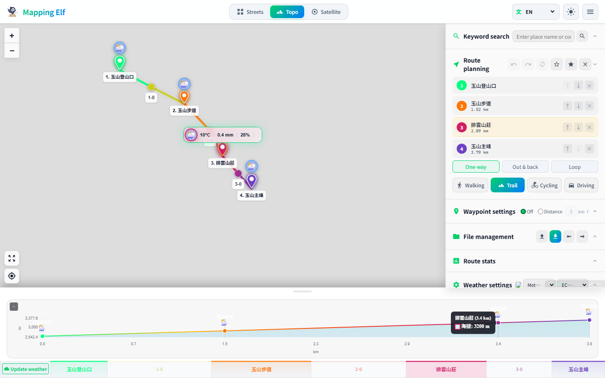
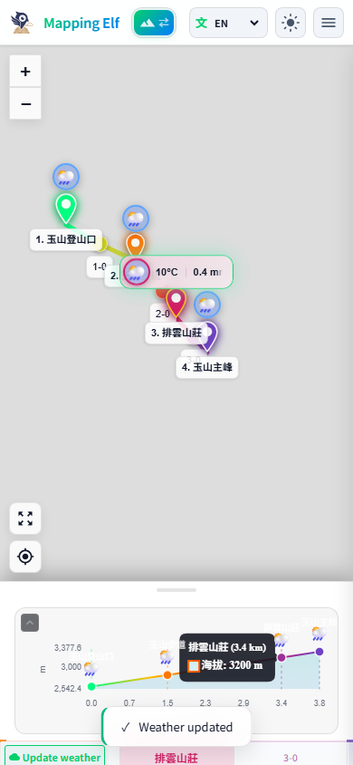

# Mapping Elf

Mapping Elf 是一套以戶外路線規劃為核心的互動式地圖應用程式，支援線上/離線地圖、GPX/KML 匯入匯出、地形高度分析、配速與熱量估算，以及沿途航點天氣資訊。專案採用 Vanilla JavaScript ES Modules、Vite、Leaflet、Chart.js 與 Capacitor 建構，可作為網頁版 PWA 使用，也能封裝為 Android/iOS App。

## 介面預覽

### 電腦版



### 手機版



## 核心功能特性

- **互動式路線規劃**：在地圖上點選航點，自動產生路線、距離、爬升/下降與高度剖面。
- **多種路線模式**：支援步行、山徑、自行車、駕車，以及單程、來回、O 繞等導航模式。
- **地圖圖層切換**：內建街道圖、地形圖與衛星圖，並針對深色/淺色主題調整圖層顯示。
- **航點天氣卡**：整合 Open-Meteo 天氣資料與 Windy 連結，在地圖航點與高度圖上顯示沿途天氣。
- **高度與配速分析**：以 Chart.js 呈現高度剖面，並依活動類型、體重、背包重量、休息與疲勞參數估算時間、熱量與補給。
- **GPX/KML 匯入匯出**：可匯入既有軌跡、重新規劃路線，並匯出含高度、航點、天氣資訊的 GPX/KML。
- **`.melmap` 地圖包**：以 JSZip 封裝路線、偏好設定與離線圖磚，方便備份或跨裝置移轉。
- **離線地圖支援**：透過 Service Worker 與 Cache API 快取地圖圖磚，支援下載目前畫面或沿路線範圍。
- **多語系介面**：內建繁中、英文、日文、韓文、法文、德文、西文與義文介面字串。
- **跨平台封裝**：透過 Capacitor 提供 Android 與 iOS 原生專案目錄。

## 系統需求與安裝步驟

### 系統需求

- Node.js 20 LTS 以上版本
- npm 10 以上版本
- 支援現代 Web API 的瀏覽器，例如 Chrome、Edge、Safari 或 Firefox
- 行動端建置選配：
  - Android：Android Studio 與 JDK
  - iOS：macOS、Xcode 與 CocoaPods 相關環境

### 安裝

```bash
npm install
```

Windows PowerShell 若因執行政策無法執行 `npm`，可改用：

```bash
npm.cmd install
```

### 開發模式

```bash
npm run dev
```

Vite 會在終端機輸出本機網址，通常可從下列位址開啟：

```text
http://localhost:5173/
```

### 建置正式版

```bash
npm run build
```

建置成果會輸出至 `dist/`。此專案的 Vite `base` 設定為 `/mapping_elf/`，適合部署到 GitHub Pages 的同名子路徑。

### 預覽正式版

```bash
npm run preview
```

### 測試

```bash
npm run test:smoke
npm run test:numeric
npm run test:chunks
```

`test:smoke` 會啟動 Playwright 測試並使用 `npm.cmd run preview -- --host 127.0.0.1` 作為本機預覽伺服器。

## 快速上手與使用範例

1. 啟動開發伺服器：

   ```bash
   npm run dev
   ```

2. 在瀏覽器開啟 Vite 提供的本機網址。

3. 在地圖上點選至少兩個位置建立航點，Mapping Elf 會自動規劃路線並更新距離、高度與統計資訊。

4. 在右側面板選擇路線模式，例如「步行」、「山徑」、「自行車」或「駕車」。

5. 在「天氣設置」或路線天氣列中更新天氣資訊，點擊地圖上的天氣圖示可展開小格或詳細天氣卡。

6. 需要離線使用時，可從檔案管理功能匯出 `.melmap` 地圖包，或下載目前地圖範圍的圖磚快取。

7. 需要交換資料時，可匯出：

   ```text
   GPX：適合 GPS 裝置與戶外 App
   KML：適合 Google Earth / Google Maps
   .melmap：保留 Mapping Elf 狀態、路線與離線地圖包資料
   ```

### 行動端建置

先建立 Web 版本，再同步到 Capacitor 原生專案：

```bash
npm run build
npx cap sync
```

開啟 Android 專案：

```bash
npx cap open android
```

開啟 iOS 專案：

```bash
npx cap open ios
```

## 專案架構說明

```text
mapping_elf/
├─ index.html                 # 應用程式 HTML 入口與主要 UI 骨架
├─ src/
│  ├─ main.js                 # App 狀態、事件流程、路線/天氣/匯入匯出整合
│  ├─ styles/
│  │  └─ main.css             # 全站樣式、響應式版面、地圖與天氣卡視覺
│  └─ modules/
│     ├─ mapManager.js        # Leaflet 地圖、圖層、航點、路線與天氣卡定位
│     ├─ routeEngine.js       # BRouter/OSRM 路線規劃與高度取樣
│     ├─ weatherService.js    # Open-Meteo 預報/歷史天氣資料解析
│     ├─ elevationProfile.js  # Chart.js 高度剖面與圖上互動標記
│     ├─ paceEngine.js        # 活動配速、疲勞、休息、熱量與補給估算
│     ├─ offlineManager.js    # Service Worker 註冊與圖磚快取管理
│     ├─ gpxExporter.js       # GPX 匯入/匯出與 Mapping Elf 擴充欄位
│     ├─ kmlExporter.js       # KML 匯出與軌跡/航點描述
│     ├─ mapPackExporter.js   # .melmap ZIP 封裝、狀態與圖磚輸出
│     ├─ mapPackImporter.js   # .melmap 還原與安全套用
│     ├─ i18n.js              # 多語系字串、WMO 天氣描述與動態翻譯
│     └─ utils.js             # 距離、座標、格式化與通用工具
├─ public/
│  ├─ sw.js                   # PWA/離線圖磚 Service Worker
│  ├─ favicon*.svg            # 網站圖示
│  └─ *cursor*.svg            # Mapping Elf 標誌與游標圖示
├─ assets/
│  ├─ readme/                 # README 截圖素材
│  ├─ promos/                 # 宣傳圖素材
│  └─ icon-*.png              # App icon / splash 資源
├─ test/
│  ├─ smoke.spec.js           # Playwright 端到端煙霧測試
│  ├─ map-layer-theme.spec.js # 地圖圖層與主題測試
│  ├─ layer-toggle.spec.js    # 圖層切換互動測試
│  ├─ numeric-regression.mjs  # 距離/配速等數值回歸測試
│  └─ chunk-output.mjs        # 建置分包檢查
├─ android/                   # Capacitor Android 專案
├─ ios/                       # Capacitor iOS 專案
├─ doc/                       # 開發文件與重構規劃
├─ tools/                     # 圖像與 SVG 輔助工具
├─ .github/workflows/         # GitHub Pages 部署流程
├─ vite.config.js             # Vite 建置與分包設定
├─ playwright.config.js       # Playwright 測試設定
├─ capacitor.config.json      # Capacitor App 設定
└─ package.json               # npm scripts 與依賴套件
```

## 授權條款

本專案採用 Apache License 2.0 授權。

除非專案內另有註明，使用、修改與散布本專案時，請遵循 Apache License 2.0 的條款。完整授權內容可參考：

```text
https://www.apache.org/licenses/LICENSE-2.0
```
