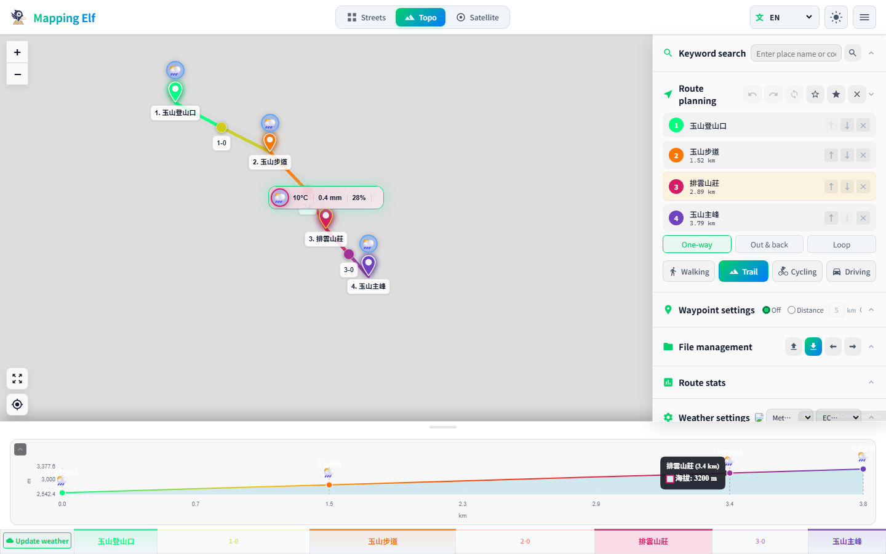
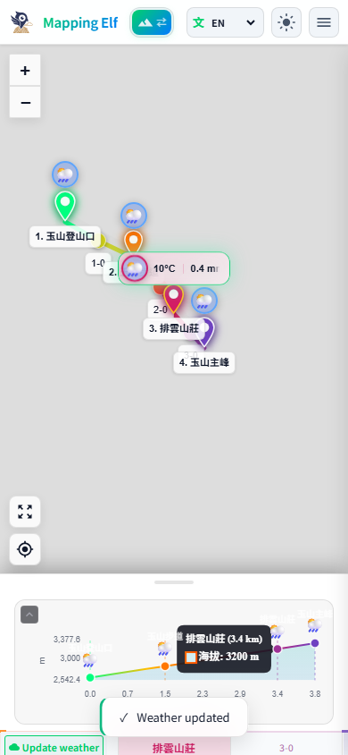

# Mapping Elf · 地圖精靈

> 戶外路線規劃的互動式地圖：線上/離線地圖、2D/3D 地形、GPX/KML 匯入匯出、逐點天氣、配速與熱量估算、集水區水文參考。
>
> An interactive outdoor route-planning map: online/offline tiles, 2D/3D terrain, GPX/KML import-export, per-point weather, pace & calorie estimation, and catchment hydrology references.

Mapping Elf 是一套**純前端**（Vanilla JS ESM）的戶外導航規劃工具，可作為網頁版 PWA 使用，也能透過 Capacitor 封裝為 Android / iOS App。所有資料以 `localStorage` 持久化，並可打包成 `.melmap` 圖資檔跨裝置移轉；地圖、路線、天氣與水文資料皆取自免費公開 API，離線時退回本機快取。

Mapping Elf is a **frontend-only** (Vanilla JS ESM) outdoor navigation planner that runs as a PWA on the web and ships as a native Android / iOS app via Capacitor. State persists in `localStorage`, exports to a portable `.melmap` bundle, and all map / route / weather / hydrology data comes from free public APIs with local-cache fallback when offline.

---

## 介面預覽 · Preview

| 電腦版 · Desktop | 手機版 · Mobile |
| --- | --- |
|  |  |

---

## 核心功能特性 · Features

- **互動式路線規劃 · Interactive routing**：地圖點選航點即自動規劃路線並計算距離、爬升/下降與高度剖面；支援單程、來回、O 繞三種導航模式。 / Click waypoints to auto-plan a route with distance, ascent/descent and an elevation profile; single, round-trip and O-loop modes.
- **多路線引擎 · Multi-engine routing**：步行 / 山徑 / 自行車 / 駕車模式，經 BRouter（hiking）與 OSRM 規劃，單段失敗自動退回逐段/直線 fallback。 / Walking / hiking / cycling / driving via BRouter and OSRM, with per-segment straight-line fallback so one bad leg never fails the whole route.
- **2D / 3D 地形檢視 · 2D & 3D terrain**：Three.js 打造可繞行的 3D 地形，貼附衛星影像、程序化 3D 天氣特效（雲、雨、雪、霧、閃電）與貼地軌跡回放。 / An orbitable Three.js terrain with draped satellite imagery, procedural 3D weather FX (cloud/rain/snow/fog/lightning) and a terrain-hugging track playback.
- **逐點天氣 · Per-point weather**：整合 Open-Meteo 預報/歷史資料，於航點與高度圖顯示小格/詳細天氣卡並附 Windy 連結；多層快取避免重複請求。 / Open-Meteo forecast/history rendered as compact/detailed weather cards on waypoints and the elevation chart, with Windy links and multi-layer caching.
- **集水區與水文 · Catchment & hydrology**：由單一出水點圈繪集水區（D8 演算），並以土壤含水、前後期雨量、GLOFAS 河川流量估算**參考級**溪水暴漲/土石流指標。 / Delineate a catchment from one pour-point (D8), with **reference-level** stream-surge / debris-flow indicators from soil moisture, rainfall and GLOFAS discharge.
- **配速與熱量 · Pace & calories**：依活動類型、體重、負重、疲勞、休息參數估算時間、熱量與補給；可匯入 GPX/KML 做個人配速校正。 / Time, calorie and resupply estimates from activity, body/pack weight, fatigue and rest; personal calibration from imported GPX/KML tracks.
- **量測工具 · Measurement tools**：軌跡區間量測、距離／面積量測、集水區量測三合一。 / Segment measurement, distance/area measurement and catchment measurement in one tool.
- **匯入匯出 · Import / Export**：匯入 GPX/KML 軌跡重新規劃，匯出含高度、航點與天氣的 GPX/KML；`.melmap`（JSZip）封裝路線、偏好與離線圖磚；3D 地形可匯出 STL / 3MF 供 3D 列印。 / Import GPX/KML to re-plan, export GPX/KML with elevation/weather, bundle everything into `.melmap`, and export the 3D terrain as printable STL / 3MF.
- **離線地圖 · Offline maps**：Service Worker + Cache API 快取圖磚，可下載目前畫面或沿路線範圍；App 版另支援魯地圖 `.map` / OpenAndroMaps / MBTiles 離線底圖。 / Service-Worker tile caching for the current view or along the route; the app build also imports 魯地圖 `.map` / OpenAndroMaps / MBTiles base maps.
- **我的最愛 · Route library**：保存、命名、重載路線，管理離線圖磚包與匯入選項。 / Save, name and reload routes; manage offline tile packs and import options.
- **多語系 · i18n**：內建 8 種語系介面（繁中 / EN / 日 / 韓 / 法 / 德 / 西 / 義）。 / Eight UI languages (zh-TW / en / ja / ko / fr / de / es / it).
- **跨平台 · Cross-platform**：同一份程式碼經 Vite 建置為 Web PWA，或經 Capacitor 8 封裝為 Android / iOS。 / One codebase builds to a web PWA (Vite) or native Android / iOS (Capacitor 8).

### 技術棧 · Tech Stack

| 領域 · Area | 技術 · Technology |
| --- | --- |
| 建置 · Build | Vite 8（rolldown）+ Vanilla JS ES Modules |
| 2D 地圖 · 2D map | Leaflet 1.9 |
| 3D 地形 · 3D terrain | Three.js 0.184 |
| 圖表 · Charts | Chart.js 4 |
| 封裝 · Packaging | Capacitor 8（Android / iOS） |
| 檔案 · Archives | JSZip 3（`.melmap`） |
| 外部 API · APIs | BRouter · OSRM · Open-Meteo · GLOFAS/Flood · Overpass · Esri Imagery |
| 測試 · Testing | Playwright · 純 Node 數值回歸 |

---

## 系統需求與安裝 · Prerequisites & Installation

### 系統需求 · Prerequisites

- **Node.js 20 LTS 以上**、**npm 10 以上**。 / Node.js 20 LTS+, npm 10+.
- 支援現代 Web API 的瀏覽器（Chrome / Edge / Safari / Firefox）。 / A modern browser (Chrome / Edge / Safari / Firefox).
- 行動端建置（選配） · Mobile builds (optional)：
  - **Android**：Android Studio + JDK 17。
  - **iOS**：macOS + Xcode + CocoaPods。

### 安裝 · Install

```bash
npm install
```

> Windows PowerShell 若因執行政策擋下 `npm`，改用 `npm.cmd install`。
> On Windows PowerShell, if execution policy blocks `npm`, use `npm.cmd install`.

---

## 快速上手 · Quick Start

```bash
# 1. 啟動開發伺服器 · Start the dev server (Vite prints the local URL, e.g. http://localhost:5173/)
npm run dev
```

在瀏覽器開啟 Vite 輸出的本機網址後：/ Open the URL Vite prints, then:

1. **建立路線** · 在地圖上點選至少兩點，Mapping Elf 會自動規劃路線並更新距離、爬升與高度剖面。 / Click at least two points on the map to auto-plan a route.
2. **選擇模式** · 在左側「路線規劃」選步行 / 山徑 / 自行車 / 駕車與單程 / 來回 / O 繞。 / Pick an activity and navigation mode in the side panel.
3. **取得天氣** · 在下方面板切到「詳細天氣」，點地圖上的天氣圖示展開小格 / 詳細天氣卡。 / Switch the bottom panel to weather and click a waypoint's weather icon.
4. **檢視 3D** · 路線就緒後點工具列 `3D`，繞行地形、播放軌跡與 3D 天氣。 / Once a route exists, tap `3D` in the toolbar to orbit the terrain.
5. **離線 / 分享** · 從「我的最愛 → 離線包」下載圖磚，或匯出 GPX / KML / `.melmap`。 / Download tiles or export GPX / KML / `.melmap` from the route library.

**匯出格式 · Export formats**

| 格式 · Format | 用途 · Use |
| --- | --- |
| `GPX` | GPS 裝置與戶外 App · GPS devices & outdoor apps |
| `KML` | Google Earth / Google Maps |
| `.melmap` | 保留 Mapping Elf 完整狀態、路線與離線圖磚包 · Full app state, route & offline tiles |
| `STL` / `3MF` | 3D 列印地形模型 · 3D-printable terrain model |

### 建置與部署 · Build & Deploy

```bash
npm run build        # 正式版建置 (base=/mapping_elf/) → dist/   · production build
npm run build:web    # Web/PWA 版 (base=/mapping_elf/)          · web build
npm run build:app    # Capacitor 版 (base=./)                   · native build
npm run preview      # 本機預覽 dist/                            · preview the build
```

> 推送到 `main` 分支會觸發 [`.github/workflows/deploy.yml`](.github/workflows/deploy.yml) 自動部署到 GitHub Pages（子路徑 `/mapping_elf/`）。
> Pushing to `main` auto-deploys to GitHub Pages under `/mapping_elf/` via the included workflow.

### 行動端建置 · Mobile builds

```bash
npm run cap:sync              # 建 Web 版並同步到 Android + iOS · build & sync both
npm run cap:sync:android     # 只同步 Android · Android only
npm run cap:sync:ios         # 只同步 iOS · iOS only
npm run android:build:debug  # 產生 debug APK · build a debug APK
npm run android:bundle:release # 產生 release AAB（需先設定簽章）· release AAB (needs signing)
```

> `release` 需先在 Android 專案設定正式簽章：複製 `android/keystore.properties.example` 為 `android/keystore.properties` 填入本機 keystore；實際 keystore 與密碼已由 `.gitignore` 排除。真機驗收依 [`doc/native-app-qa.md`](doc/native-app-qa.md)。
> Release builds require signing: copy `android/keystore.properties.example` to `android/keystore.properties`. Device QA steps live in `doc/native-app-qa.md`.

### 測試 · Testing

```bash
npm run test:numeric   # 距離/爬升/配速數值回歸（純 Node,最快）· numeric regression (pure Node)
npm run test:smoke     # Playwright GUI 冒煙測試（自動起 preview server）· Playwright smoke suite
npm run test:mobile    # 行動端 App QA 流程 · mobile app QA flow
npm run test:chunks    # 建置分包檢查 · bundle-split check
npm run test:native-config # Capacitor 設定驗證 · native config check

# 跑單一 spec · run a single spec
node test/run-playwright-with-preview.mjs test/<file>.spec.js
```

> Playwright 相關測試會先服務 `dist/`，請先 `npm run build:web` 以免測到舊版建置。
> Playwright specs serve the pre-built `dist/`; run `npm run build:web` first so you test current code.

---

## 專案架構 · Project Structure

資料流心智模型：`src/main.js`（orchestrator，持有全域 UI 狀態）→ 呼叫 `src/modules/*`（純邏輯）→ 持久化一律走 `localStorage`（key 由 `stateKeys.js` 統一列管）。平台差異一律經 `src/platform/` 抽象，模組內不得直接呼叫 Capacitor plugin。

Data-flow model: `src/main.js` (orchestrator, owns global UI state) → `src/modules/*` (pure logic) → `localStorage` (keys registered in `stateKeys.js`). Platform differences go through `src/platform/`; modules never call Capacitor plugins directly.

```text
mapping_elf/
├─ index.html                # 應用程式 HTML 入口與 UI 骨架 · app shell & UI markup
├─ vite.config.js            # Vite 建置與分包設定 · build & code-splitting config
├─ capacitor.config.json     # Capacitor App 設定 · native app config
├─ playwright.config.js      # Playwright 測試設定 · test config
├─ src/
│  ├─ main.js                # Orchestrator：狀態、事件、路線/天氣/匯入匯出接線
│  ├─ styles/main.css        # 全站樣式、RWD、地圖與卡片視覺
│  ├─ platform/              # 平台抽象 (web / capacitor) · platform abstraction
│  │  ├─ index.js            # 執行期挑選平台 · picks platform at runtime
│  │  ├─ webPlatform.js
│  │  └─ capacitorPlatform.js
│  └─ modules/               # 純邏輯模組 · pure-logic modules
│     ├─ mapManager.js       # Leaflet 地圖、圖層、航點、路線
│     ├─ routeEngine.js      # BRouter/OSRM 路線 + 高程取樣
│     ├─ weatherService.js   # Open-Meteo 預報/歷史天氣
│     ├─ weatherPointBuilder.js # 沿路線佈天氣/取樣點
│     ├─ elevationProfile.js # Chart.js 高度剖面
│     ├─ paceEngine.js       # 配速、疲勞、休息、熱量、補給
│     ├─ terrainViewer.js    # Three.js 3D 地形檢視器
│     ├─ weatherFx3D.js      # 程序化 3D 天氣特效
│     ├─ terrainExporter.js  # 3D 地形 STL / 3MF 匯出
│     ├─ catchmentEngine.js  # 集水區圈繪 (DEM → D8)
│     ├─ catchmentHydro.js   # 集水區水文參考指標
│     ├─ offlineManager.js   # Service Worker + 圖磚快取
│     ├─ offlineTileIndex.js # 離線圖磚包索引
│     ├─ offlineMapSourceIndex.js # App 離線底圖來源索引
│     ├─ tileEstimator.js    # 圖磚數量/容量估算
│     ├─ gpxExporter.js      # GPX 匯入/匯出
│     ├─ kmlExporter.js      # KML 匯出
│     ├─ mapPackExporter.js  # .melmap 封裝
│     ├─ mapPackImporter.js  # .melmap 還原
│     ├─ i18n.js             # 8 語系字串 + WMO 天氣描述
│     ├─ stateKeys.js        # localStorage key 分類列管
│     └─ utils.js            # 距離、座標、格式化工具
├─ public/                   # sw.js（PWA）、favicon、logo/游標、privacy.html
├─ assets/                   # App icon、splash、readme/promo/store 素材
├─ test/                     # Playwright specs + 純 Node 數值/設定測試
├─ doc/                      # 開發、部署、隱私、重構與離線策略文件
├─ scripts/                  # 建置輔助腳本 · build helper scripts
├─ android/ · ios/           # Capacitor 原生專案 · native projects
└─ .github/workflows/        # GitHub Pages 部署流程 · deploy workflow
```

> 座標慣例：專案內部一律 `[lat, lng]`；BRouter/OSRM 回傳的 `[lng, lat]` 只在 `routeEngine.js` 邊界轉換。開發前請先讀 [`CLAUDE.md`](CLAUDE.md) 的歷史地雷與工作守則。
> Coordinate convention: internally `[lat, lng]`; the `[lng, lat]` from BRouter/OSRM is swapped only at the `routeEngine.js` boundary. See `CLAUDE.md` for engineering rules and known pitfalls.

---

## 授權條款 · License

本專案採用 **Apache License 2.0** 授權，完整條款見 [`LICENSE`](LICENSE)。

Licensed under the **Apache License 2.0** — see [`LICENSE`](LICENSE) for the full text.

```text
Copyright 2026 Chang Wei Lin
Licensed under the Apache License, Version 2.0.
http://www.apache.org/licenses/LICENSE-2.0
```
